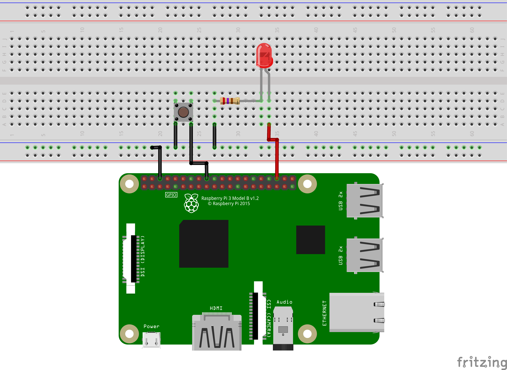
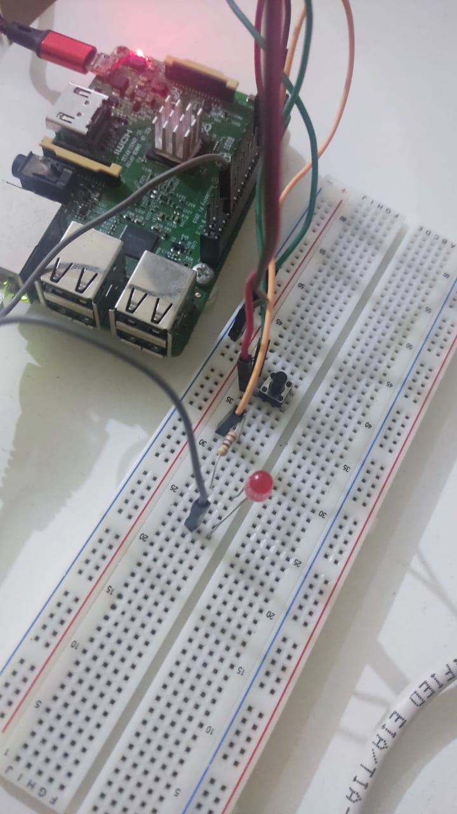
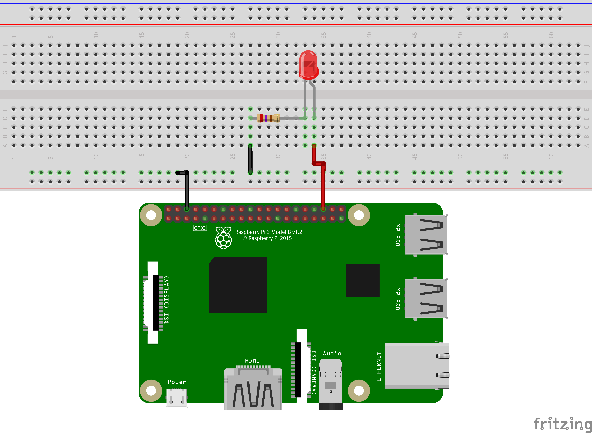
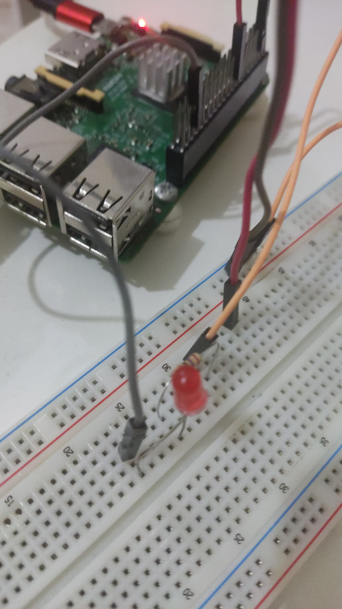

# Prática 2
- Mateus Santos Messias - NºUSP: 12548000 
- Pedro Borges Gudin - NºUSP: 12547997

## Parte 1: Introdução à Programação em Sistemas Embarcados com GPIO

### Objetivos
Familiarizar-se com os conceitos básicos de programação em Python para manipulação de GPIO na Raspberry Pi, incluindo:
- Estruturas condicionais e laços de repetição
- Importação de bibliotecas e manipulação de erros
- Uso do GPIO para controlar componentes externos como LEDs

### Acender um LED ao pressionar o botão e apagar quando soltar o botão
O LED está conectado ao GPIO16 e o botão no GPIO24




### [Script em python](./Codigos/led_botao.py)
```python
import RPi.GPIO as GPIO
import time

# Configurar a biblioteca RPi.GPIO para usar o esquema de numeração BCM
GPIO.setmode(GPIO.BCM)

# Definir os pinos GPIO para o LED e o botão
LED_PIN = 16
BUTTON_PIN = 24

# Configurar o pino do LED como saída e o pino do botão como entrada com pull-down resistor
GPIO.setup(LED_PIN, GPIO.OUT)
GPIO.setup(BUTTON_PIN, GPIO.IN, pull_up_down=GPIO.PUD_UP)

try:
    while True:
        # Verificar se o botão está pressionado
        if GPIO.input(BUTTON_PIN) == GPIO.LOW:
            GPIO.output(LED_PIN, GPIO.HIGH)  # Acender o LED
        else:
            GPIO.output(LED_PIN, GPIO.LOW)  # Apagar o LED
        time.sleep(0.1)  # Pequeno atraso para evitar alta carga de CPU

except KeyboardInterrupt:
    pass  # Permitir que o usuário interrompa o programa com Ctrl+C

finally:
    # Limpar os pinos GPIO ao sair
    GPIO.cleanup()
```

### Acender um LED após a contagem regressiva de um valor de tempo de entrada, em segundos, digitado no termina
O LED está conectado ao GPIO16 como anteriormente




### [Script em python](./Codigos/cronometro_led.py)
```python
import RPi.GPIO as GPIO
import time

# Configuração dos pinos GPIO
LED_PIN = 16
GPIO.setmode(GPIO.BCM)
GPIO.setup(LED_PIN, GPIO.OUT)

def countdown_timer(seconds):
    """Função para realizar a contagem regressiva."""
    while seconds:
        # Usando divmod para converter segundos em minutos e segundos
        minutes, secs = divmod(seconds, 60)
        time_format = '{:02d}:{:02d}'.format(minutes, secs)
        print(time_format, end='\r')  # Imprime o tempo formatado na mesma linha
        time.sleep(1)  # Espera por 1 segundo
        seconds -= 1
    
    print("\nContagem finalizada!")
    GPIO.output(LED_PIN, GPIO.HIGH)  # Acende o LED após a contagem regressiva

def get_valid_input():
    """Função para solicitar e validar a entrada do usuário."""
    while True:
        try:
            # Solicita um valor ao usuário
            time_input = input("Digite o tempo em segundos para a contagem regressiva: ")
            time_input = int(time_input)  # Converte a entrada para inteiro
            
            # Verifica se o valor é positivo
            if time_input <= 0:
                print("O número deve ser positivo. Tente novamente.")
            else:
                return time_input  # Retorna o valor válido
        except ValueError:
            print("O valor digitado deve ser um número inteiro. Tente novamente.")

try:
    # Solicita a entrada do usuário e realiza a contagem
    time_in_seconds = get_valid_input()
    countdown_timer(time_in_seconds)

except KeyboardInterrupt:
    print("\nPrograma interrompido pelo usuário.")

finally:
    GPIO.cleanup()  # Limpa a configuração dos pinos GPIO

```
### [Histórico dos comandos](./Codigos/historico_comandos_01.txt)


## Parte 2: PWM e Sensores

### Objetivos
Expandir os conhecimentos em GPIO para incluir:
- PWM (Modulação por Largura de Pulso)
- Integração com sensores de presença, temperatura, e outros.

### Utilização do PWM para controlar a intensidade de um LED.
O LED está conectado ao GPIO16


### [Script em python](./Codigos)
```python

```

### Exploração de aplicações práticas usando sensores como o HC-SR04 para medição de distâncias.


### [Script em python](./Codigos)
```python

```

### Resultados
Desenvolvimento de scripts que modulam a intensidade de um LED via PWM e utilizam o sensor de distância HC-SR04 para ativar um LED baseado na proximidade de um objeto.

---

## Parte 3: Computação Paralela com Processos e Threads

### Objetivos
Introduzir conceitos de computação paralela em sistemas embarcados usando threads e processos para melhorar a eficiência e resposta do sistema.

### Procedimentos
1. Implementação de threads para permitir que múltiplas tarefas ocorram simultaneamente, como piscar um LED e contar aleatoriamente.
2. Uso de mutexes e semáforos para gerenciar o acesso a recursos compartilhados.

### Resultados
Desenvolvimento de um sistema onde processos paralelos melhoram a resposta do sistema a eventos externos, demonstrando o uso eficaz de multithreading e sincronização de processos.

---

## Conclusão
As práticas abordaram conceitos fundamentais para programação em sistemas embarcados usando a Raspberry Pi, desde controle básico de GPIO até aplicações avançadas envolvendo PWM, sensores e computação paralela, preparando os alunos para desenvolvimentos mais complexos e integrados.

