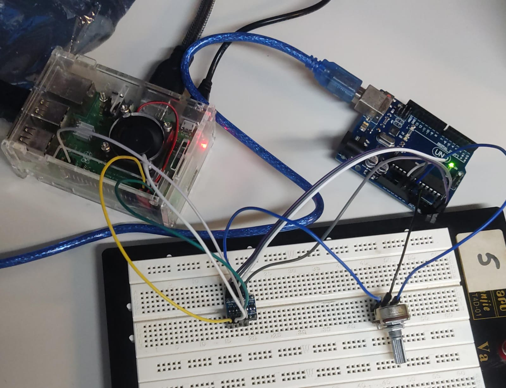

# Prática 3
- Mateus Santos Messias - NºUSP: 12548000 
- Pedro Borges Gudin - NºUSP: 12547997

## Parte 1: Comunicação Serial I2C entre Raspberry Pi e Microcontrolador

### Objetivos
Familiarizar-se com a comunicação serial I2C entre uma Raspberry Pi e um microcontrolador (Arduino), visando a leitura de dados analógicos e a integração entre as plataformas:
- Utilização do protocolo de comunicação I2C
- Manipulação de GPIO para comunicação entre SBC (Single Board Computer) e microcontrolador
- Programação em C e Python

### Descrição do Projeto
Nesta parte, a Raspberry Pi atua como controlador que requisita leituras de um potenciômetro conectado ao Arduino. A comunicação ocorre via protocolo I2C, e o valor lido é exibido tanto no terminal do Arduino quanto no terminal da Raspberry Pi.

#### Hardware Utilizado
- Raspberry Pi 3B+
- Arduino Uno
- Potenciômetro conectado ao pino analógico do Arduino
- Conversor de nível lógico 3,3V-5V para adequação dos níveis de tensão entre as duas placas

### Conexões
- Pinos SDA e SCL da Raspberry Pi (GPIO2 e GPIO3) conectados aos pinos A4 e A5 do Arduino por meio do conversor de nível lógico.
- Pino central do potenciômetro conectado a um pino analógico do Arduino.

### [Script em Python para a Raspberry Pi](./Codigos/I2C_Raspberry.py)
```python
import smbus
import time

# Inicializa o barramento I2C
bus = smbus.SMBus(1)  # 1 indica /dev/i2c-1

# Endereço I2C do Arduino (deve corresponder ao definido no Arduino)
DEVICE_ADDRESS = 0x08

def read_potentiometer():
    try:
        # Solicita 2 bytes do Arduino
        data = bus.read_i2c_block_data(DEVICE_ADDRESS, 0, 2)
        
        # Reconstrói o valor original usando bit shift
        pot_value = data[0] * 256 + data[1]
        
        return pot_value
    except Exception as e:
        print(f"Erro na leitura I2C: {e}")
        return None

if __name__ == "__main__":
    while True:
        value = read_potentiometer()
        if value is not None:
            print(f"Valor recebido: {value}")
        time.sleep(1)  # Aguarda 1 segundo antes da próxima leitura

```

### [Script em C para o Arduino](./Codigos/I2C_Arduino.cpp)
```c
#include <Wire.h>

#define I2C_ADDRESS 0x08  // Endereço I2C do Arduino (pode ser ajustado conforme necessário)
#define POT_PIN A0        // Pino analógico conectado ao potenciômetro

void setup() {  
  Wire.begin(I2C_ADDRESS);        // Inicializa o Arduino como escravo I2C
  Wire.onRequest(requestEvent);   // Registra a função de callback para requisições
  Serial.begin(9600);             // Inicializa a comunicação serial para depuração
}

void loop() {
  // O loop pode permanecer vazio, pois a ação é tratada na função de requisição
}

void requestEvent() {
  int potValue = analogRead(POT_PIN); // Lê o valor do potenciômetro (0-1023)
  
  byte highByteValue = highByte(potValue); // Obtém o byte superior
  byte lowByteValue = lowByte(potValue);   // Obtém o byte inferior
  
  Wire.write(highByteValue); // Envia o byte superior
  Wire.write(lowByteValue);  // Envia o byte inferior
  
  // Exibe o valor no terminal serial para verificação
  Serial.print("Valor enviado: ");
  Serial.println(potValue);
}
```

### Imagens do Circuito


### Imagens da comunicação nos terminais
 

## Parte 2: Comunicação SPI com Controle de Acesso via RFID

### Objetivos
Implementar um sistema de controle de acesso utilizando comunicação SPI entre a Raspberry Pi e o módulo RFID:
- Utilizar o módulo RFID MFRC522 para leitura de tags
- Controlar acesso com a leitura de identificadores das tags

### Descrição do Projeto
Neste projeto, a Raspberry Pi lê a identificação de uma tag RFID. Dependendo do ID lido, a Raspberry aciona um LED verde (acesso liberado) ou um LED vermelho (acesso negado).

#### Hardware Utilizado
- Raspberry Pi 3B+
- Módulo RFID MFRC522
- LEDs verde e vermelho

### Conexões
- Pinos SDA, SCK, MOSI, MISO do RFID conectados aos respectivos pinos da Raspberry Pi (GPIO8, GPIO11, GPIO10, GPIO9)
- LEDs conectados a GPIOs da Raspberry Pi

### [Script para Gravar na Tag RFID](./Codigos/RFID_gravar.py)
```python
#para gravação de texto na Tag
import RPi.GPIO as GPIO
from mfrc522 import SimpleMFRC522
#desabilita os avisos
GPIO.setwarnings(False)
#cria o objeto "leitor" para a instância "SimpleMFRC522" da biblioteca
leitor = SimpleMFRC522()
#criacao da variavel que armazena o texto que será gravado na tag
texto = "SEL097/0097" #altere para o texto que deseja gravar
#escreve a tag assim que ela for aproximada do leitor, e informa a conclusão
print("Aproxime a tag do leitor para gravar.")
leitor.write(texto) #função que realiza a gravação do texto configurado
print("Concluído!")

```

### [Script para Leitura da Tag RFID](./Codigos/RFID_leitura.py)
```python
from mfrc522 import SimpleMFRC522
from time import sleep
import RPi.GPIO as GPIO

# Desabilitar os avisos
GPIO.setwarnings(False)
# Configurar a numeração dos pinos para seguir a numeração física
GPIO.setmode(GPIO.BOARD)
# Configurar os pinos dos LEDs
LED_VERDE = 16  # Pino do LED verde
LED_VERMELHO = 18  # Pino para o LED vermelho
GPIO.setup(LED_VERDE, GPIO.OUT)
GPIO.setup(LED_VERMELHO, GPIO.OUT)

# Lista de IDs cadastrados
ids_cadastrados = {"SEL097/0097"}  # IDs cadastrados

# Cria o objeto "leitor" para a instância "SimpleMFRC522" da biblioteca
leitor = SimpleMFRC522()
print("Aproxime a tag do leitor para leitura.")

try:
    while True:  # Loop infinito
        # Lê o ID e o texto da tag RFID
        id, texto = leitor.read()
        print("ID: {}\nTexto: {}".format(id, texto))  # Exibe as informações coletadas

        # Verifica se o ID está cadastrado
        if id in ids_cadastrados:
            GPIO.output(LED_VERDE, GPIO.HIGH)  # Acende o LED verde
            GPIO.output(LED_VERMELHO, GPIO.LOW)  # Apaga o LED vermelho
            print("Tag cadastrada!")
        else:
            GPIO.output(LED_VERMELHO, GPIO.HIGH)  # Acende o LED vermelho
            GPIO.output(LED_VERDE, GPIO.LOW)  # Apaga o LED verde
            print("Tag não cadastrada!")

        sleep(3)  # Aguarda 3 segundos para nova leitura

finally:
    GPIO.cleanup()  # Limpa a configuração dos GPIOs ao terminar

```
### Imagens do Circuito
