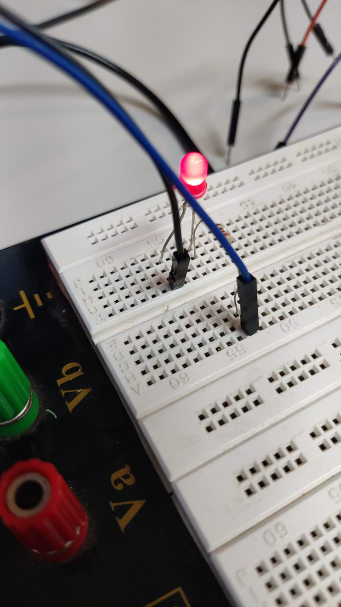

# Prática 4
- Mateus Santos Messias - NºUSP: 12548000 
- Pedro Borges Gudin - NºUSP: 12547997

## Objetivo
Adicionar uma unidade de serviço personalizada (systemd service unit) para gerenciar a inicialização e execução de um projeto em sistemas embarcados com S.O. Linux, permitindo a inicialização automática da aplicação durante o boot do sistema operacional.

## Descrição do Projeto
Nesta prática, configuramos o `systemd` para gerenciar a execução automática de um script que realiza o blink de um LED. O diferencial deste projeto é que o script shell que foi desenvolvido em Python especifica o interpretador na primeira linha (`#!/bin/python`), removendo a necessidade das etapas posteriores para especificar o interpretador, pois ja é especificado no próprio arquivo.

### Hardware Utilizado
- Raspberry Pi 3B+
- LED conectado ao GPIO da Raspberry Pi

### Conexões
- LED conectado ao GPIO18 da Raspberry Pi

## Parte 1: Script shell para Blink LED

### [Script em Python para Blink LED](./Codigos/blink_led.sh)
```bash
#!/bin/python
import RPi.GPIO as GPIO
import time

# Configuração do GPIO
GPIO.setmode(GPIO.BCM)
GPIO.setup(18, GPIO.OUT)

try:
    while True:
        GPIO.output(18, GPIO.HIGH)  # Acender o LED
        time.sleep(0.2)
        GPIO.output(18, GPIO.LOW)   # Apagar o LED
        time.sleep(0.2)

except KeyboardInterrupt:
    print("\nPrograma interrompido pelo usuário.")

finally:
    GPIO.cleanup()  # Limpar configurações do GPIO
```

## Parte 2: Arquivo de Serviço SystemD

### [Arquivo de Serviço SystemD](./Codigos/blink_led.service)
```ini
[Unit]
Description= Blink LED
After=multi-user.target

[Service]
ExecStart=/home/sel/led_blink.sh
#ExecStop=
user=SEL

[Install]
WantedBy=multi-user.target
```

## Passos para Configurar o Serviço no SystemD
1. Salve o script Python como `blink_led.py` e o arquivo de serviço como `blink_led.service`.
2. Torne o script Python executável:
   ```bash
   chmod +x /home/pi/Codigos/blink_led.py
   ```
3. Copie o arquivo de serviço para o diretório de serviços do systemd:
   ```bash
   sudo cp /home/pi/Codigos/blink_led.service /lib/systemd/system/
   ```
4. Inicie o serviço para testar:
   ```bash
   sudo systemctl start blink_led
   ```
5. Habilite o serviço para iniciar automaticamente no boot:
   ```bash
   sudo systemctl enable blink_led
   ```
6. Reinicie a Raspberry Pi e verifique se o LED começa a piscar automaticamente.

### Imagem do led ligando e apagando após a reinicialização do sistema 

